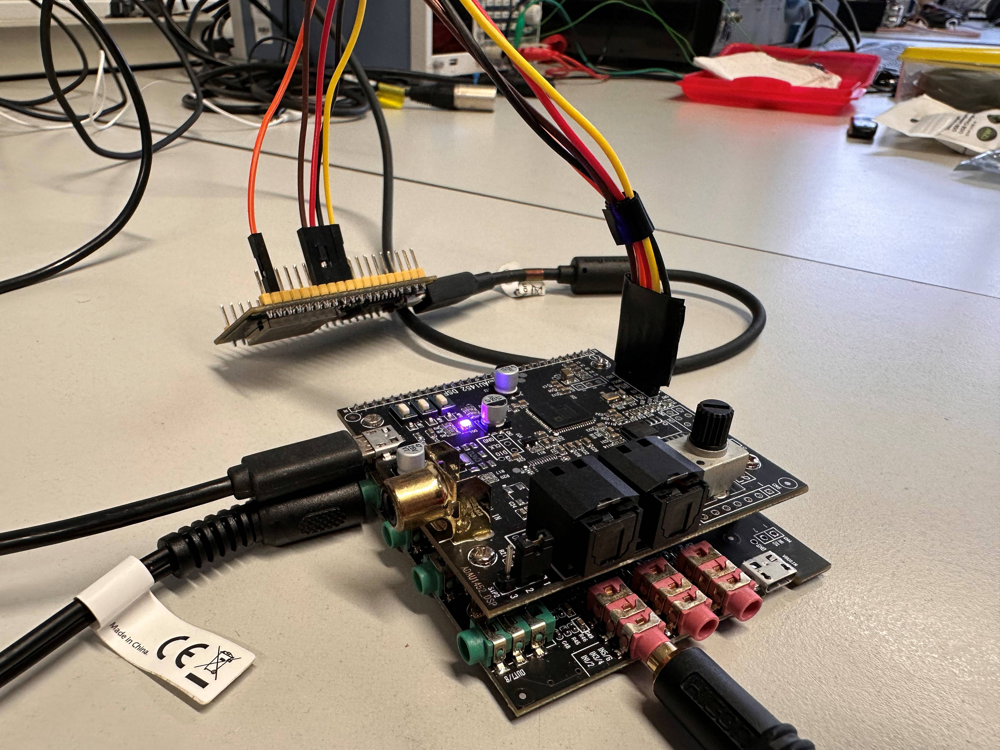
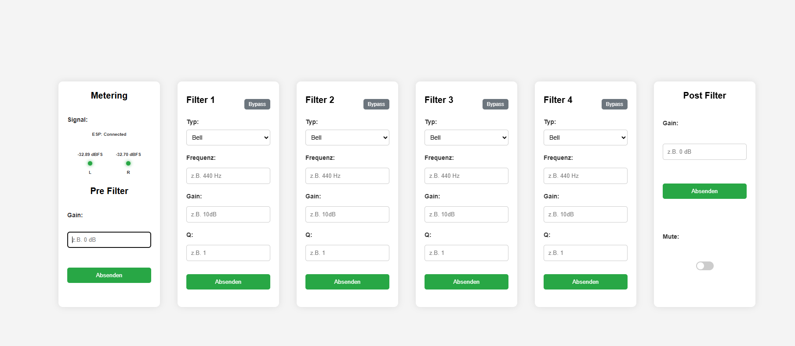

# Webbase-DSP-System

A university project for controlling a DSP system via a web interface. Includes ESP32 firmware, web frontend, and DSP configuration files.

+ Devices: 
    + ESP32 (Arduino)
    + ADAU 1452 Board [ebay](https://www.ebay.de/itm/156411835090)

| Screenshot | Description |
|------------|-------------|
|  | Hardware Set UP |
|  | Web frontend |

---

## Table of Contents
- [Installation](#installation)
- [Usage](#usage)
- [Project Structure](#project-structure)
- [Contributing](#contributing)
- [License](#license)

---

## Installation

1. Clone the repository:
```bash
git clone https://github.com/lucae98/webbase-DSP-system.git
cd webbase-DSP-system
```

2. Open the PlatformIO project (ESP32):
    + check and edit source Code
    + Use VSCode with the PlatformIO extension.
    + Check platformio.ini and select the correct ESP32 board.

3. Use your Browser to open the index.html 
    + check and edit source Code
    + view the website
    + F5 when you change something &rarr; see the results

4. Install [Sigma Studio] (https://www.analog.com/en/resources/evaluation-hardware-and-software/software/ss_sigst_02.html) 4.7 (ADAU1452) 
    + check and edit configuration
    + check tutorials for Sigma Studio for further infos

5. Connections:

    + The pins may differ from the board you are using. 

    + **SPI:**

        | Device | Pin | &rarr; | Device | Pin | 
        |--------|-----|--------|--------|-----|
        |ESP 32 MOSI|23|&rarr;|ADAU MOSI|MOSI|
        |ESP 32 MISO|19|&rarr;|ADAU MISO|MISO|
        |ESP 32 CLK|18|&rarr;|ADAU CLK|CLK|
        |ESP 32 CS|5|&rarr;|ADAU CS|CS|
        |ESP 32 GND|GDN|&rarr;|ADAU GDN|GND|
        |PSU|USB|&rarr;|ESP 32|Micro USB|
        |PSU|USB|&rarr;|ADAU |Only one Micro USB is required|

    + **Audio:**

        | Device | Pin | &rarr; | Device | 
        |--------|-----|--------|--------|
        |ADAU IN L |RED IN 1|&rarr;|Audio Source L|
        |ADAU IN R |RED IN 2|&rarr;|Audio Source R|
        |ADAU OUT L |GREEN OUT 1|&rarr;|Audio Target L|
        |ADAU OUT R |GREEN OUT 2|&rarr;|Audio Target R|


## Usage:

 + **ESP32 Firmware:** Flash the firmware and the data (website, config) via VS-Code and PlatformIO
    + Write the Website-Data and config.json to Flash-Memory of the ESP32 &rarr; ../webbase-DSP-system/firmware/data
 + **ADAU1452 Firmware:** Open the SigmaStudio project and load the configuration on the DSP (ADAU1452)
 + **Web Interface:** Connect to the WiFi-Network from the ESP32 &rarr; Open a browser and go to the ESP32 IP address &rarr; you find the initial config (e.g.: IP, SSID, WiFi-Key) in ../webbase-DSP-system/firmware/data/config.json


## Project Structur

```text
webbase-DSP-systemwir/
├─ docs/ # Documentation 
├─ dsp/ # SigmaStudio DSP projects
├─ firmware/ # ESP32-Firmware (Arduino)
├─ sim/ # Jupyter-Notebook for biquad-filter simulation
├─ web/ # Website files
└─ README.md
```

## Contributing

 + Please submit changes via pull requests.
 + Create a new branch before making modifications.
 + Document any major changes in the README.md or ../docs/.
 + You can find ideas for new features in ../docs/FEATURES.md


 ## License:
 
 + GNU General Public License v3.0
